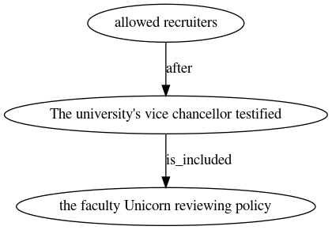

# temporal-graph-gen

Pre-trained model and supporting scripts for [Neural Language Modeling for Contextualized Temporal Graph Generation](https://www.aclweb.org/anthology/2021.naacl-main.67/)


## Generation

1. Download pre-trained model [here](https://drive.google.com/file/d/161wl_sxlghXfWmR6917CdbqTMDIGOHaq/view?usp=sharing).

2. Prepare an input ``jsonl`` file. Each line of this file should be a ``json`` with the input text present in key "text":
```json
{"text": "text1"}
{"text": "text2"}
.
.
.
{"text": "textN"}
```

3. Run generation using:
```sh
python src/generate.py --model-path <path-to-model-checkpoint>\
                       --use-finetuned True\
                       --input-path <path-to-input-jsonl-file>\
                       --output-path <path-to-output-jsonl-file>
```
Where:
  - `path-to-model-checkpoint`: path to the pre-trained model downloaded in step 1.
  - `path-to-input-jsonl-file`: path to the input file prepared in step 2.
  - `path-to-output-jsonl-file`: path to the output file. The output file contains a temporal graph corresponding to each line of text in the input.


## Example
Input (data/test_input.json)
```
{"text": "Witnesses expected to testify for the defendants included former Attorney General Ramsey Clark and a former Nicaraguan rebel leader , Edgar Chamorro . The university 's vice chancellor , Dennis L. Madson , testified today that as a result of the demonstrations the faculty senate was reviewing the university policy that allowed C.I.A. recruiters on campus . "}
```

Generation:
```sh
python src/run_generation.py --model-path data/model-checkpoints/temporal-graph-gen/\
  --use-finetuned True\
  --input-path test.json\
  --output-path test_output.json 
```

Output:
```
{"text": "Witnesses expected to testify for the defendants included former Attorney General Ramsey Clark and a former Nicaraguan rebel leader , Edgar Chamorro . The university 's vice chancellor , Dennis L. Madson , testified today that as a result of the demonstrations the faculty senate was reviewing the university policy that allowed C.I.A. recruiters on campus . ", "temporal_graph": "{\n\"the facultyILS reviewing policy\" -- \"The university's vice chancellor testified\"  [rel=is_included];\n\"allowed recruiters\" -- \"The university's vice chancellor testified\"  [rel=after];\n}"}
```

## Parsing Temporal Graphs
The temporal graphs are dumped in the [DOT](https://graphviz.org/doc/info/lang.html) language. While it is possible that some of the graphs generated are not valid DOT files (the output is generated by drawing samples from GPT-2 using nucleus sampling), in our tests ~94\% of the generated graphs were valid DOT files.
The generated graphs can be thus be used with libraries like Graphviz or [networkx](https://networkx.github.io/) for downstream applications.

We also provide a simple wrapper over these graphs in ``src/temporal_graph.py``.

For example, the following script parses the output graph generated above.
```sh
python src/temporal_graph.py data/test_output.json data/test_out.png
```



## Citation

```
@inproceedings{madaan-yang-2021-neural,
    title = "Neural Language Modeling for Contextualized Temporal Graph Generation",
    author = "Madaan, Aman  and
      Yang, Yiming",
    booktitle = "Proceedings of the 2021 Conference of the North American Chapter of the Association for Computational Linguistics: Human Language Technologies",
    month = jun,
    year = "2021",
    address = "Online",
    publisher = "Association for Computational Linguistics",
    url = "https://www.aclweb.org/anthology/2021.naacl-main.67",
    pages = "864--881",
}
```
