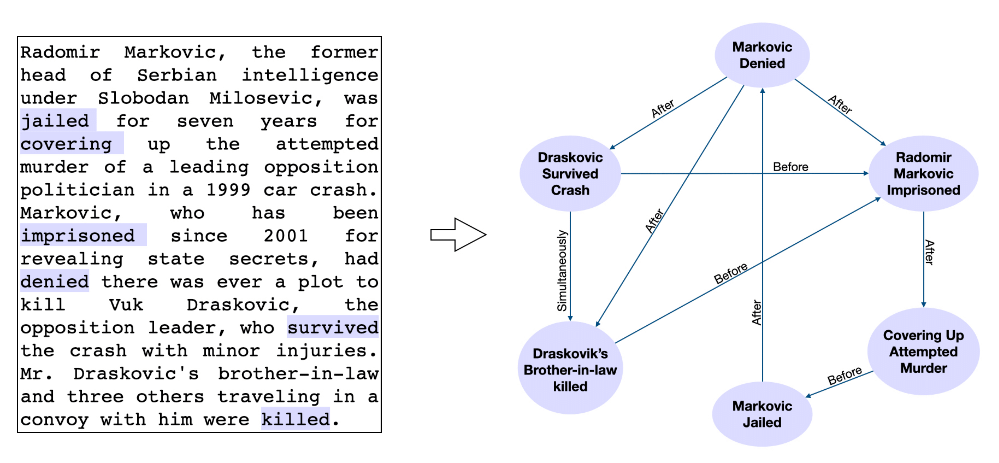
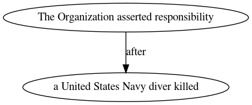

# Neural Language Modeling for Contextualized Temporal Graph Generation

Model and inference scripts for [this paper](https://www.aclweb.org/anthology/2021.naacl-main.67/)





## Outline

* [Temporal Graph Generation](#temporal-graph-generation)
* [Temporal Node Generation](#temporal-node-generation)

<hr/>

## Temporal Graph Generation

1. Download the fine-tuned model (GPT-2) [here](https://drive.google.com/file/d/161wl_sxlghXfWmR6917CdbqTMDIGOHaq/view?usp=sharing) (alternatively, if you use gdown: `gdown --id 161wl_sxlghXfWmR6917CdbqTMDIGOHaq`).


2. Prepare an input ``jsonl`` file. Each line of this file should be a ``json`` with the input document present in key `text`:
```json
{"text": "text1"}
{"text": "text2"}
.
.
.
{"text": "textN"}
```

3. Run generation using:
```sh
python src/run_generation.py --task graphgen\
                       --model-path <path-to-model-checkpoint>\
                       --input-path <path-to-input-jsonl-file>\
                       --output-path <path-to-output-jsonl-file>
```
Where:
  - `path-to-model-checkpoint`: path to the pre-trained model downloaded in step 1.
  - `path-to-input-jsonl-file`: path to the input file prepared in step 2.
  - `path-to-output-jsonl-file`: path to the output file. The output file is identical to the input file with one additional field (`generated_graph`).


### Example
Input (data/test_input.json)
```
{"text": "That , in turn , is thought to have ties to the Party of God , a better-known guerrilla faction inspired by revolutionary Iran . The Organization of the Oppressed on Earth , asserted responsibility for the June 1985 hijacking of a Trans World Airways jetliner in which a United States Navy diver , Robert D. Stethem , was killed . It is not known where Colonel Higgins is being held ."}
```

Generation:
```sh
python src/run_generation.py  --task graphgen \
  --model-path data/model-checkpoints/temporal-graph-gen/\
  --input-path data/graphgen/test_input.jsonl\
  --output-path data/graphgen/test_output.jsonl
```

Output:
```
{"text": "That , in turn , is thought to have ties to the Party of God , a better-known guerrilla faction inspired by revolutionary Iran . The Organization of the Oppressed on Earth , asserted responsibility for the June 1985 hijacking of a Trans World Airways jetliner in which a United States Navy diver , Robert D. Stethem , was killed . It is not known where Colonel Higgins is being held .", "generated_graph": "strict graph  {\n\"The Organization asserted responsibility\" -- \"a United States Navy diver killed\"  [rel=after];\n}"}
```

### Parsing Temporal Graphs
The temporal graphs are generated in the [DOT](https://graphviz.org/doc/info/lang.html) language. While some of the generated graphs might not be valid DOT files (the output is generated by drawing samples from GPT-2 using nucleus sampling), we expect such cases to be rare as in our tests ~94\% of the generated graphs were valid DOT files.
The generated DOT graphs can be used with libraries like Graphviz or [networkx](https://networkx.github.io/) for downstream applications.

We also provide a simple wrapper over these graphs in ``src/temporal_graph.py``.

For example, the following script parses the output graph generated above.
```sh
python src/temporal_graph.py data/test_output.json data/test_out.png
```


The generated graphs can also be visualized using [Edotor](https://edotor.net/?engine=dot#strict%20digraph%20%20%7B%0A%22The%20Organization%20asserted%20responsibility%22%20-%3E%20%22a%20United%20States%20Navy%20diver%20killed%22%20%20%5Blabel%3Dafter%5D%3B%0A%7D).


<hr/>

## Temporal Node Generation

We also introduce a related sub-task of temporal node generation (section 3, task 1 in the [paper](https://www.aclweb.org/anthology/2021.naacl-main.67.pdf)). The steps for using the pre-trained GPT-2 for task 1 are identical to task 2.

1. Download the fine-tuned model [here](https://drive.google.com/file/d/1_uBXr2bh8UVH3tlaSMnTLr0jzenorPZx/view?usp=sharing) (or you can `gdown --id 1_uBXr2bh8UVH3tlaSMnTLr0jzenorPZx`).

2. `Input`: The input should be of the form:

```json
{"question": "text1"}
{"question": "text2"}
.
.
.
{"question": "textN"}
```
Where `question` is the query string (see section 3 for details or the example below).

3. Run generation using:
```sh
python src/run_generation.py --task nodegen\
                       --model-path <path-to-model-checkpoint>\
                       --input-path <path-to-input-jsonl-file>\
                       --output-path <path-to-output-jsonl-file>
```
Where:
  - `path-to-model-checkpoint`: path to the pre-trained model downloaded in step 1.
  - `path-to-input-jsonl-file`: path to the input file prepared in step 2.
  - `path-to-output-jsonl-file`: path to the output file. The output file contains a temporal graph corresponding to each line of text in the input.


### Example

* Sample input (`data/nodegen/test_input.jsonl`):
```js
{"question": "Ms. Baeszler , 43 , relaxed by doing needlepoint . She had perfected it . She gave a needlepoint tapestry of a horse 's head to a childhood friend , who is an equestrian . She made a cocoa pot for an aunt who collects them . which event happened before She gave tapestry ?"}
```

* Generation script
```sh
python src/run_generation.py --task nodegen\
                             --model_path $CKPT\
                             --input_path data/nodegen/test_input.jsonl\
                             --output_path data/nodegen/test_output.jsonl
```

Where `$CKPT` points to the path to the downloaded model.

* Sample output
```js
{"question": "Ms. Baeszler , 43 , relaxed by doing needlepoint . She had perfected it . She gave a needlepoint tapestry of a horse 's head to a childhood friend , who is an equestrian . She made a cocoa pot for an aunt who collects them . which event happened before She gave tapestry ?", "generated_answer": "She perfected it"}
```

<hr/>

## Citation

```
@inproceedings{madaan-yang-2021-neural,
    title = "Neural Language Modeling for Contextualized Temporal Graph Generation",
    author = "Madaan, Aman  and Yang, Yiming",
    booktitle = "Proceedings of the 2021 Conference of the North American Chapter of the Association for Computational Linguistics: Human Language Technologies",
    month = jun,
    year = "2021",
    address = "Online",
    publisher = "Association for Computational Linguistics",
    url = "https://www.aclweb.org/anthology/2021.naacl-main.67",
    pages = "864--881",
}
```
